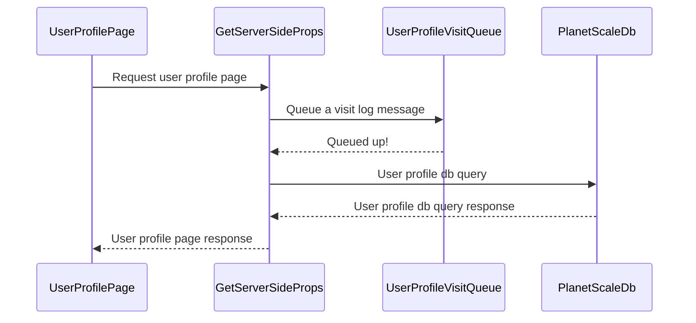
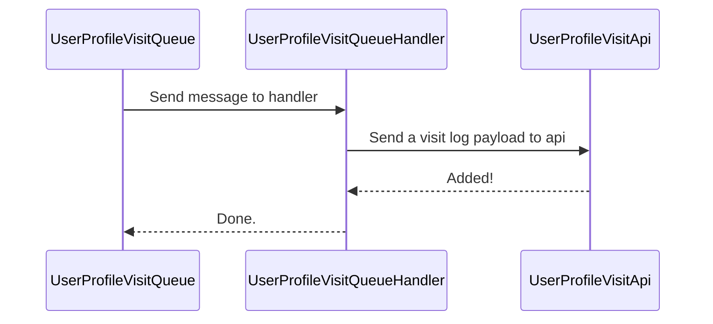
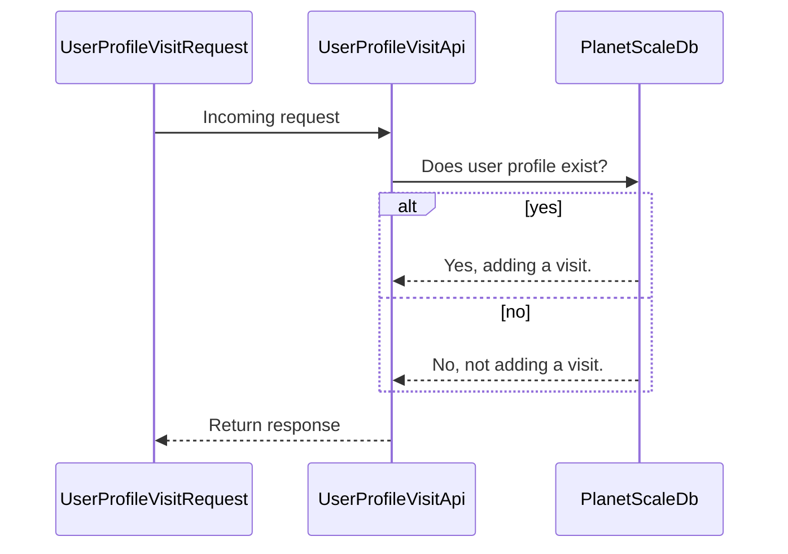
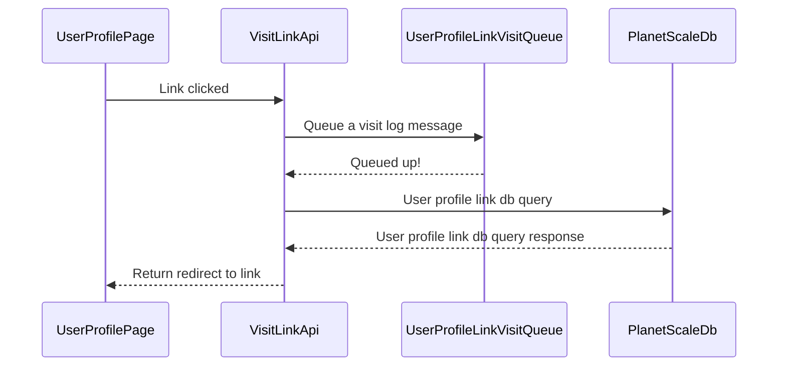
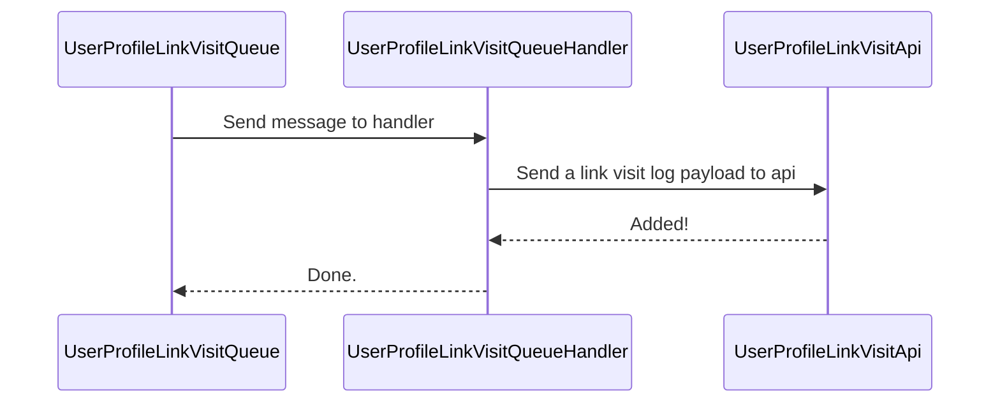
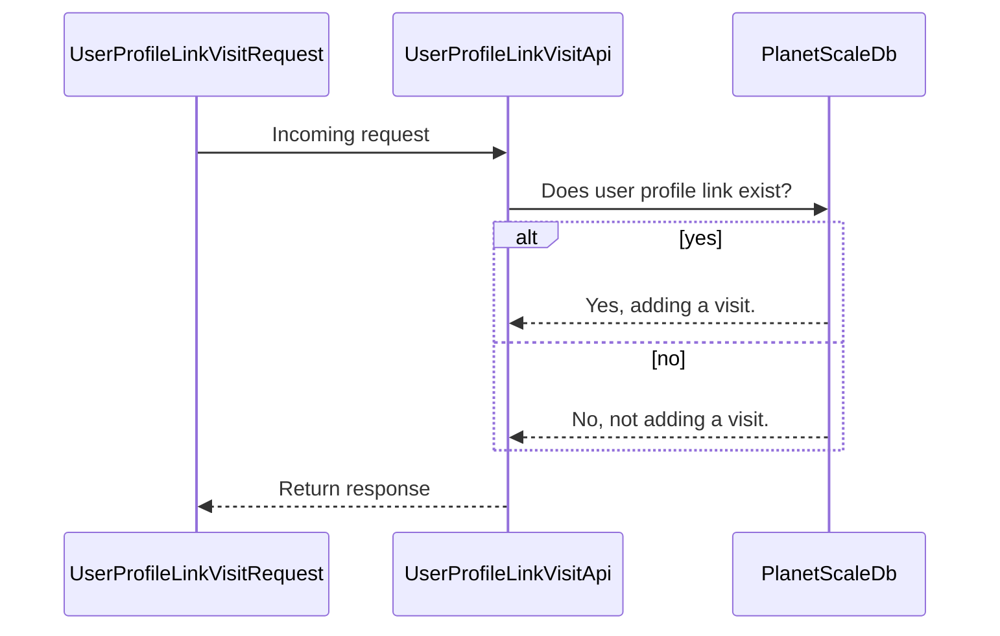

# Design Decisions

## The overall architecture:
- **App:** NextJs app (Typescript, React, Prisma)
- **AWS Lambda** - User Profile Link Visit logging (Go)
- **AWS Lambda** - User Profile Visit logging (Go)
- **AWS SQS Queue** - User Profile Visit Queue
- **AWS SQS Queue** - User Profile Link Visit Queue
- **Planetscale MySql database**

### Why did I decide to go for a queue -> lambda architecture?
To the outsider, this seems really overkill. At the end of the day all we are doing is queueing a message saying for this id here is it's metadata (device info etc) from the next app. Then the lambda will process this and add the visit to the database.

There are a few reasons for doing it this way:
1. I wanted to learn and play about with Go, and there is no better way than building something in a language you want to learn.
2. Planetscale is a serverless MySQL db. This means I face the issue of cold start times, which means that users requesting to view someones profile might take a longer time than hoped for. Therefore to reduce any further burden on the request duration, I decided to move the registering of a new visit from the inline page request to a queue -> lambda mechanism. Hopefully this means as we scale we will notice a marginal difference vs doing everything inline.
3. I wanted to use AWS as it is my favourite cloud provider and gives me a lot of free stuff.

## Link page profile visit flow

## User profile visit lambda flow
Note: Currently i am just doing a http request from the go handler to a next endpoint. In the future I would like to do all the work including the sql query inside of the handler. But for simplicity right now I want to do it this way.

## User profile visit api

## Link page profile link visit flow

## User profile link visit lambda flow
Note: Currently i am just doing a http request from the go handler to a next endpoint. In the future I would like to do all the work including the sql query inside of the handler. But for simplicity right now I want to do it this way.

## User profile link visit api
